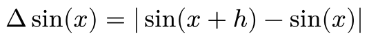
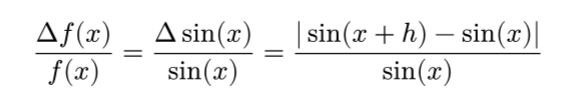
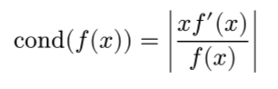
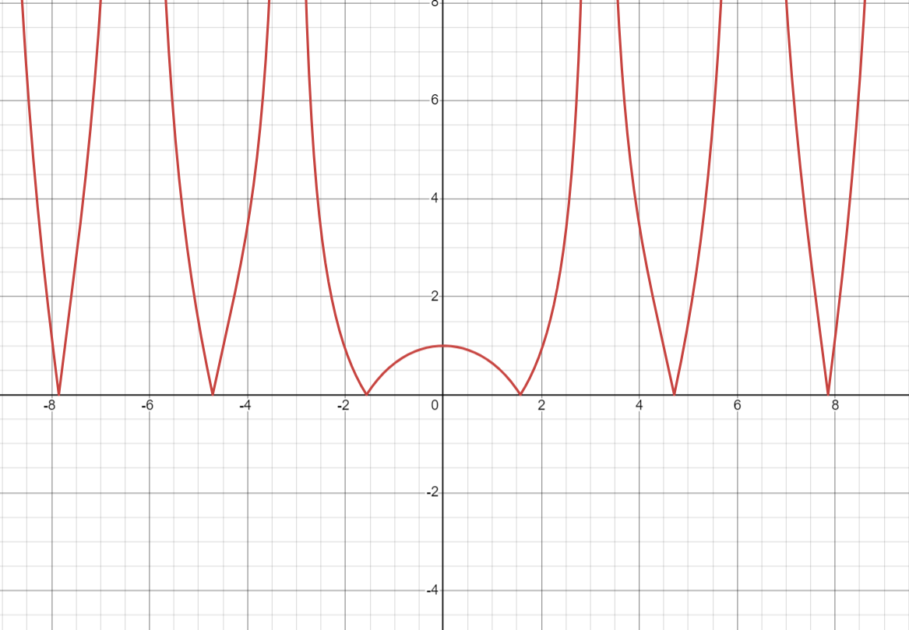

<p style="text-align:center; font-size: 25px">Laboratorium 1</p>
<p style="text-align:center; font-size: 25px">Metody obliczeniowe w nauce i technice</p>
<p style="text-align:center; font-size: 15px">Mateusz Ryś</p>
<p style="text-align:center; font-size: 15px">13 Marca 2025</p>

### 1.Treści zadań

1.Znaleźć "maszynowe epsilon", czyli najmniejszą liczbę a, taką że a+1>1

2.Rozważamy problem ewaluacji funkcji sin(x), m.in. propagację błędu danych wejściowych, tj. błąd wartości funkcji ze względu na zakłócenie h w argumencie x:
    a) Ocenić błąd bezwzględny przy ewaluacji sin(x)

    b) Ocenić błąd względny przy ewaluacji sin(x)

    c) Ocenić uwarunkowanie dla tego problemu

    d) Dla jakich wartości argumentu x problem jest bardzo czuły ?

3.Funkcja sinus zadana jest nieskończonym ciągiem

    a) sin(x) = x – x^3/3! + x^5/5! – x^7/7! + …

    b) Jakie są błędy progresywny i wsteczny jeśli przybliżamy funkcję sinus biorąc tylko pierwszy człon rozwinięcią, tj.sin(x) ≈ x, dla x = 0.1, 0.5 i 1.0 ?

    c) Jakie są błędy progresywny i wsteczny jeśli przybliżamy funkcję sinus biorąc pierwsze dwa człony rozwinięcią, tj.sin(x) ≈ x - x^3/6, dla x = 0.1, 0.5 i 1.0 ?

4.Zakładamy że mamy znormalizowany system zmiennoprzecinkowy z β = 10, p = 3, L = -98

    a) Jaka jest wartość poziomu UFL (underflow) dla takiego systemu ?

    b) Jeśli x = 6.87 x 10^(-97) i y = 6.81 x 10^(-97), jaki jest wynik operacji x – y ?

<div style="page-break-after: always;"></div>

### 2. Rozwiązania zadań

#### 2.1 Zadanie 1

Na wstępie powiedzmy coś o standardzie IEEE 754 w którym zapisuje się liczby zmiennoprzecinkowe. Zapisuje się je na 32 bitach gdzie pierwszy bit przeznaczony jest na znak, 8 na wykładnik, a pozostałe 23 przeznacza się na mantyse

<p style="text-align:center;">S EEEEEEEE MMMMMMMMMMMMMMMMMMMMMMM</p>

Głównym celem naszego zadania jest znalezienie "maszynowego epsilonu" czyli najmniejszej liczby która po jej dodaniu do jedynki daje liczbę większą od 1 to znaczy a+1 > a. Szukamy owej liczby dzieląc liczbę a przez 2 do momentu gdy dodanie jej do 1 nie da 1. Poniżej wklejam algorytm który szuka epsilonu

```python
import numpy as np

epsilon = np.float32(1.0)
epsilon_last = epsilon

while epsilon + np.float32(1.0) > 1:
    epsilon_last = epsilon
    epsilon = epsilon/np.float32(2.0)

print("Maszynowy epsilon dla float32 to:",epsilon_last)
```

Wynikiem powyższego algorytmu jest:

```
Maszynowy epsilon dla float32 to: 1.1920929e-07
```

#### 2.2 Zadanie 2

a) Błąd bezwzględny - czyli różnica wartości przybliżonej do wartości rzeczywistej:
<figure style="text-align:center;">
    
</figure>

b) Błąd względny - jest to iloraz błędu względnego z wartością rzeczywistą:

<figure style="text-align:center;">
    
</figure>

c) Uwarunkowania

<figure style="text-align:center;">
    
</figure>

<figure style="text-align:center;">
    
    <figcaption>Rys 1: Wykres funkcji uwarunkowania</figcaption>
</figure>

d) Problem jest czuły w sytuacji gdzie funkcja uwarunkowana zmieża do ∞, czyli dla x = kπ. Za to najlepiej uwarunkowana będzie kiedy cond zmieża do 0, czyli dla x = kπ + 0.5*π

#### 2.3 Zadanie 3

